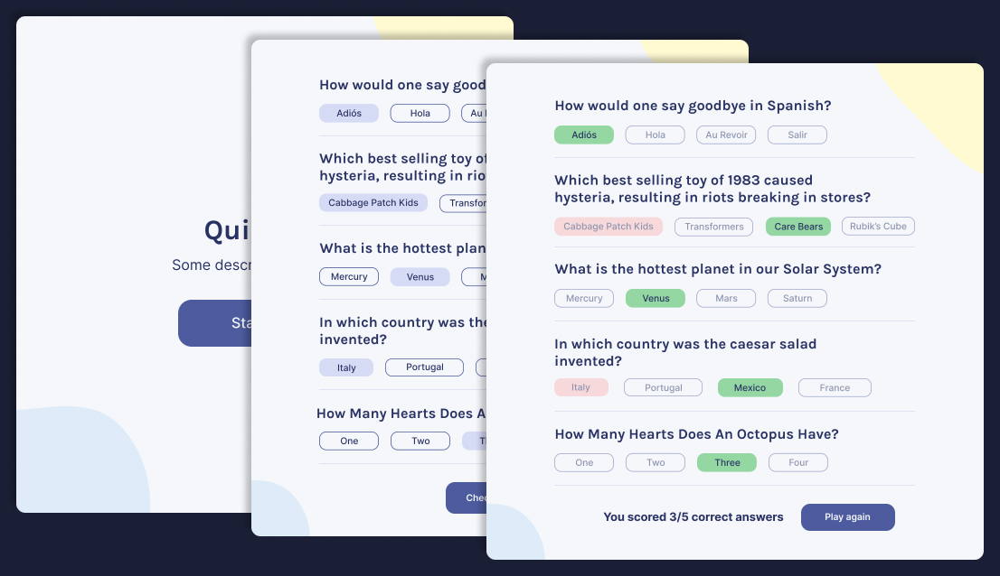

# Quizzical

This project is part of the _Learn React_ course by Scrimba.



## Requirements

- Two screens (start and questions)
- Pull 5 questions from [OTDB API](https://opentdb.com/api_config.php)
- Tally correct answers after check button is clicked

## Lil' Challenges

- Decode HTML Entities from API response using [he](https://www.npmjs.com/package/he) or [html-entities](https://www.npmjs.com/package/html-entities)
- Shuffle answer options because the API response is something like:
  ```json
  {
    ...
    "correct_answer": "String here...",
    "incorrect_answers": [
      "String here...",
      "String here...",
      "String here...",
      "String here...",
    ]
  }
  ```
- Limit answer choice to 1 and style selected answer
  - Track the selected answer index inside each question object, or
  - Use HTML form with radio inputs with the same `name`

## Step by step

- [x] Code and style start screen
- [ ] Code and style questions screen
- [ ] Handle routing between screens
- [ ] Fetch API
- [ ] Shuffle answers array
- [ ] Checking correct answers and end the game
